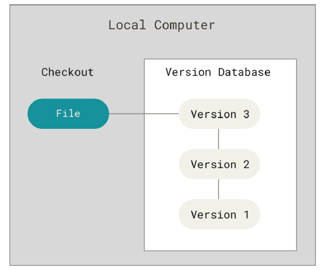
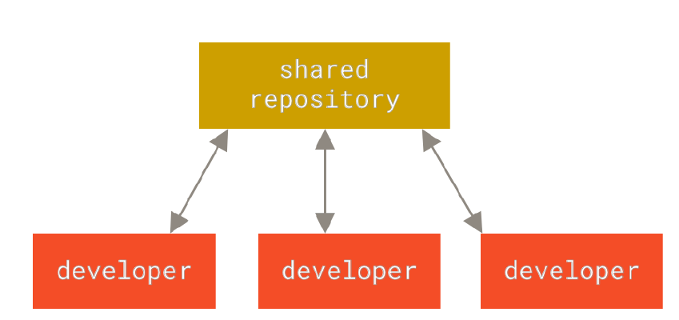
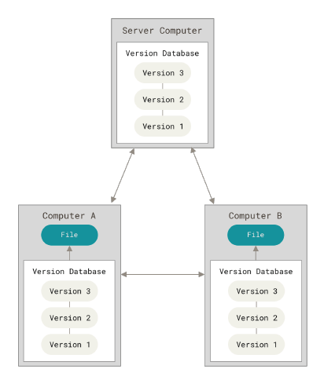
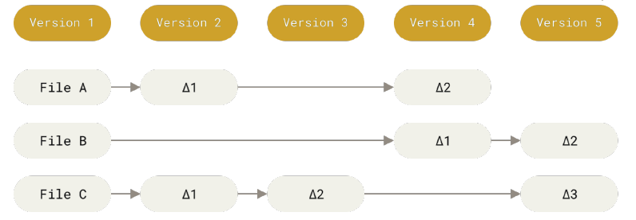
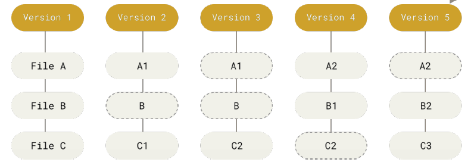
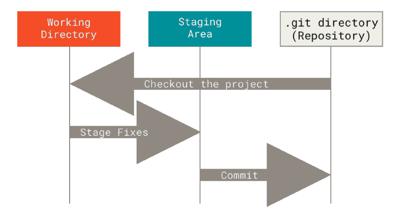

# Getting started

## What is Version control ?

* It records the changes to a set of files over   time and can recall any version of the file any time

* Compare changes over time to the files

* Revert the project or files any time to older version

* Collaboration

* Recovery

## History of development of VCS

* Directory based VCS - New versions of the files would be put into new folders

* Local VCS - A local databased in the system that records all the changes to files

* Centralized VCS - A single central database where all the data regarding the history of file resides which also helps people to collaborate on projects

* Distributed VCS - These systems mirror the full repository including all the history, every clone is really a full backup of all the data

## Working of Git

* Most version control systems stores the changes between the version of files and use those changes made to a file to recall a particular version of the file (patch differences). These are also called as delta based version control

* Git takes a snapshot of the project at that time when you commit and stores a reference to that snapshot - everything in git is stream of snapshots

### Particulars of Git

* Every operation can be performed locally (offline)
* Integrity - everything in git is checksummed before it is stored (SHA-1)
* Difficult to delete or do something undoable, so there are no risks of messing things or lose something

### Three file states of Git

| State of file | Location     | Description                |
| :-------- | :------- | :------------------------- |
| Modified | Working tree/Staging area | Files that have been changed but not yet commited |
| Staged | Staging area/Index | Have marked a modified file to into your next commit snapshot |
|Commited | .git directory | Data is stored in local database |

### Workflow

* Modify files in working tree
* Stage the modified files that will be part of next commit
* Commit the staged files which stores a snapshot in the git directory

