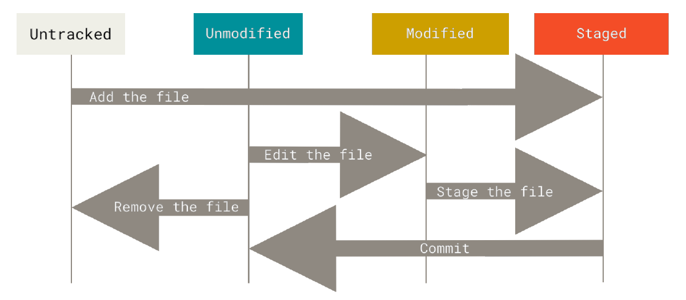
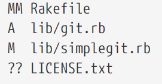

# Git Basics

## Setting a Git Repository

* Convert a local directory into a git repository - sets up a ```.git``` directory which contains the metadata and skeleton

         git init

* Cloning a git repository from elsewhere - pulls the whole history of that repository

        git clone <url>

## Lifecycle of status of files



## Basic commands

        git status - to find the status of files
        git add <filename> - to stage files

### Short status

        git status -s



- right column - status of working tree
- left column - status of staging area
- ```A``` - added to staging area
- ```M``` - modified files
- ```??``` - untracked files

### Ignoring files

To skip files from adding to staging area, mention those files in the ```.gitignore``` file

### Comparing files

- To view the details of changes made to the files in your working tree and staging area
        
            git diff

- To view the difference between last commit and files in the staging area
            
            git diff --staged

### Commits
- To commit with message  - ```git commit -m "type in the commit message"```

- To skip staging and commit  - ```git commit -a```

### Remove files

- To remove files from git directory and working tree - ```git rm <filename>```

- To remove from git directory but retain in working tree - ```git rm --cached <filename>```

### Moving files

- To move file (git doesn't track file movement but rather it moves->delete->stage) - ```git mv <src> <destination>```

### Viewing commit history

-  ```git log```

| options |description         
| :-------- | :------------------------- |
| -p | displays the diff (patch difference) |
| --stat | stats | 
|-graph | graphical with branches |
| --pretty | prettier |
| --since=2.weeks | duration |
| -S name | to view that particular string commmits |
| git log -- path/to/file | to view commits on that file | 

### Undo actions

* To redo a commit - ```git commit --amend```
* To unstage a file - ```git reset HEAD <file>```
* To unmodify a file with last commited version or staged version - ```git checkout -- <file> ```
* To unstage a file - ```git restore --staged <file>```
* To unmodify a file with last commited version or staged version - ```git restore <file> ```


