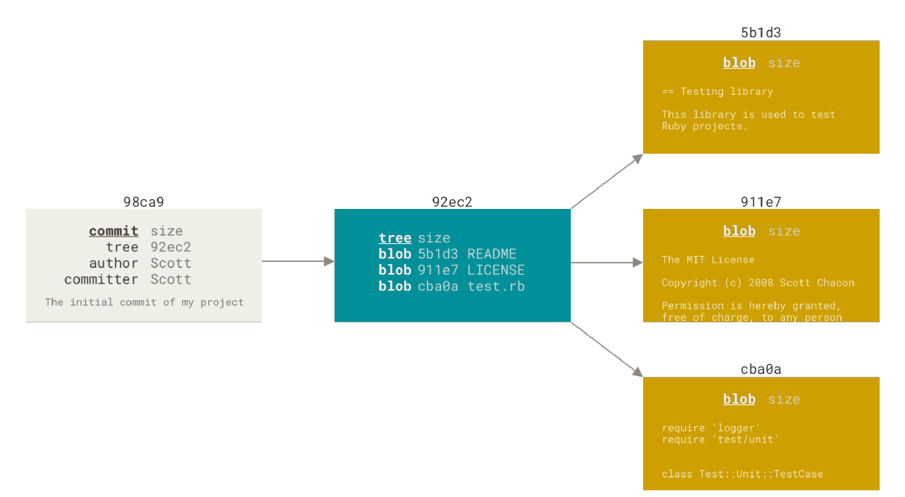
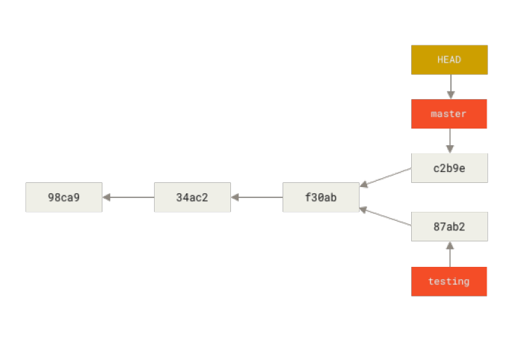
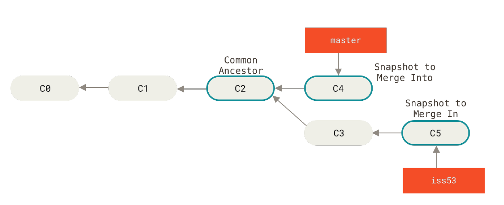

# Branching

## What is branch ?

* Branching is simply diverting from your main line of development and continue your work in that branch
* When you commit, git stores a commit object that contians a pointer to the sanpshot of the content you staged aong with other metadata (authors, email)
* Git stores the tree object (corresponds to each directory in your project), content itself in compressed form as blobs, commit object that points to the tree object



## Git Branch

* Branches in Git are essentially lightweight movable pointers
* ```HEAD``` is a special pointer that points to the current branch
* When you switch branches the local files also change based on the branch



### Branch commands

* To create branch - ```git branch <branch>```
* To switch to a branch - ```git checkout <branch>```
* To view all logs on all branches - ```git log --all```
* To create and switch to branch - ```git checkout -b <branch>```
* To switch to a branch - ```git switch <branch>```
* To create and switch to branch - ```git switch -c <branch>```
* To delete branch - ```git branch -d <branch>```

## A three way merge



## Merge conflicts

* After resolving the conflicts in both the files, stage the files - ```git add```
* Commit your staging area

## Branch Management

* To list all branches - ```git branch```
* To see the branches along with last commits - ```git branch -v [--merged] | [--no-merged]```
* To rename branch locally - ```git branch --move <old branchname> <new branchname>```
* To rename branch on remote - ```git push --set-upstream <remote> <new branchname>```
* To delete branch on remote - ```git push <remote> --delete <branchname>```


