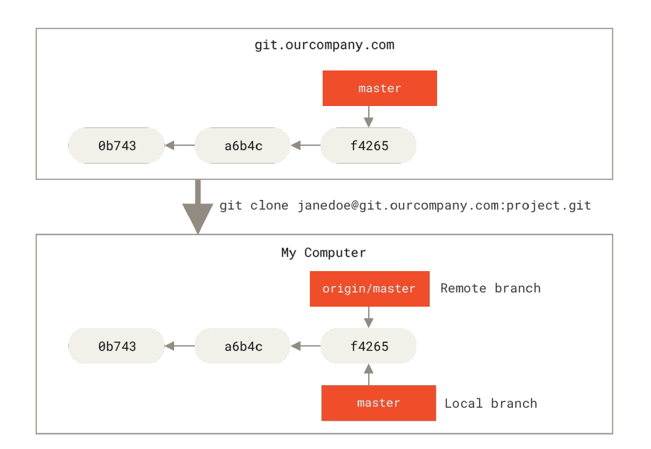
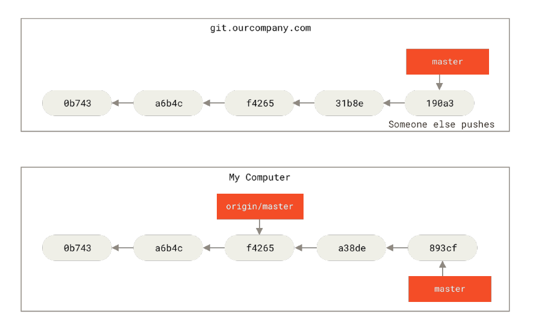
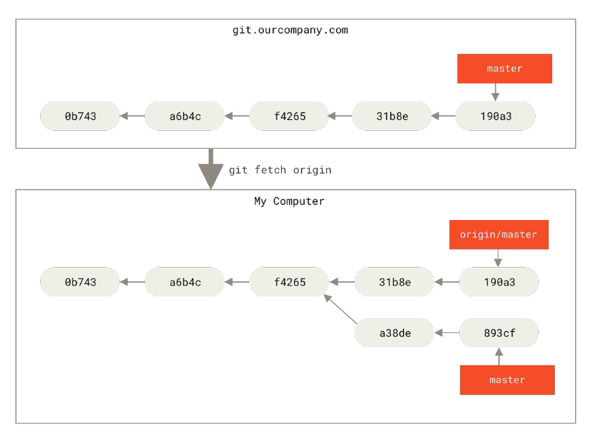
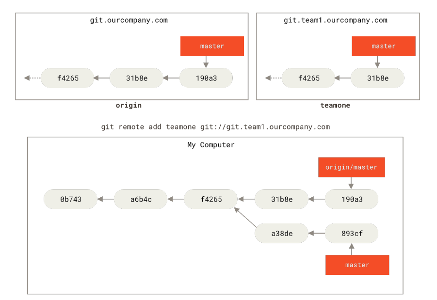
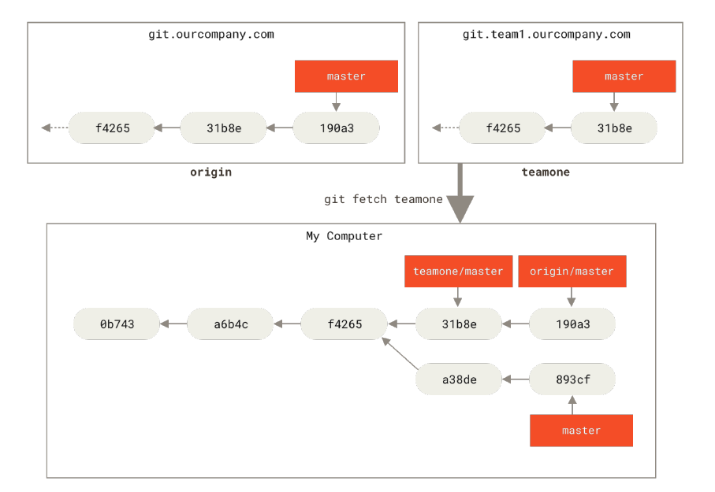

# Remote Branches

These are references in your remote repositories. These remote tracking branches are references to the state of your remote repositories that you can't move, git moves them only when you do any network communication to make sure that these references represent the state of remote repository


## Examples

* Remote branches are in the form ```<remote>/<branch>```
* Fetch command simply fetches the latest data based on your remote repository since you last downloaded and updates the remote tracking branches in your local, but does not merge it
* Even the new remote-branches that you fetch won't create local editable copies, they simply bring the pointer only

### Single remote example







### Multiple remote example





## Push

* To push your branch - ```git push <remote> <branch>``` or ```git push <remote> <local branch>:<remote branch>```
* To fetch new remote branches - ```git fetch <remote>```
* To merge new remote branch into current working branch - ```git merge <remote>/<branch>```
* To merge and branch off - ```git checkout -b <newbranchname> <remote>/<branch>```

## Tracking branches

* Local branch that was checked out from a remote tracking branch creates something as ```tracking branch``` and the branch that it tracks is called ```upstream branch```
* To create and create a local branch that tracks a remote branch - ```git checkout --track <remote>/<branch>```
* To track a remote branch with an existing local branch - ```git branch -u <remote>/<branch>```
* shorthand for upstream branch - ```@{u}```
* To list the tracking branches and upstream branches (outputs data since last fetch, to get latest fetch and use the command) - ```git branch -vv```
* ```git pull``` automatically fetches and merges with your local working directory based on the tracking branch


