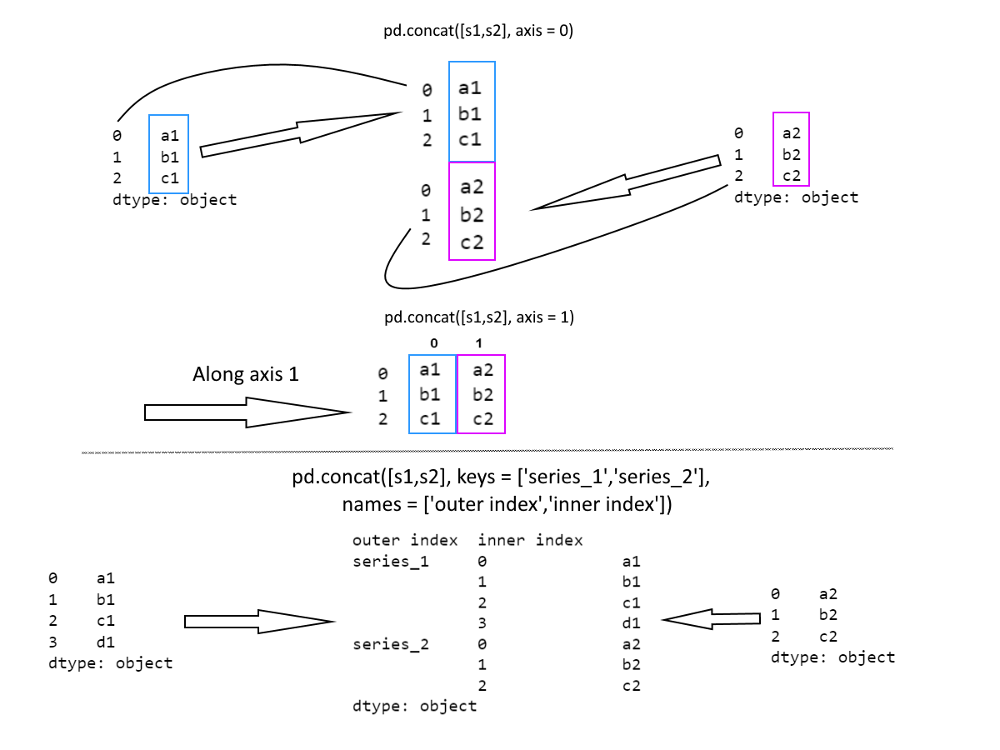

# Combining data in Pandas

* Set logics and relational algebra functionalities can be used with these functions
* Functions used to combine ```Series```, ```DataFrame```
    * ```merge()```
    * ```concat()```
    * ```join()```
    * ```compare()```

## ```concat()```

* Performs concatenation along a given axis along with optional union, intersection operations on other axes
* Hierarchical indexing is also possible

### Performance and usage

* rather than looping and adding rows, a single ```concat``` can be used

### Simple concatenation
#### Series



