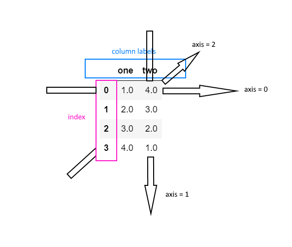

# Basics of DataFrame in Pandas

* It is a 2D labeled data structure with columns of any data type
* It has index labels row wise and column labels, column wise



## Structure

* It has columns with each column having it's own name and of any data type
* It also has index elements for each row
* ```axis = 0``` simply means operations along the row and ```axis=1``` corresponds to operations along the column, and higher axis numbers corresponds to higher dimensional axis

[https://stackoverflow.com/questions/22149584/what-does-axis-in-pandas-mean](https://stackoverflow.com/questions/22149584/what-does-axis-in-pandas-mean)

> 

## DataFrame Creation

* Series
* Dict of list, dict or Series
* Another DataFrame
* 2D NumPy ```ndarray```

## Some of the attributes

* ```DataFrame.index``` - row labels of dataframe that identify each row
* ```DataFrame.columns``` - column labels of dataframe
* ```DataFrame.dtypes``` - data types of each column returned as ```Series``` with index as the column names
* ```DataFrame.values``` - numpy representation of dataframe with just the data, labels removes
* ```DataFrame.axes``` - axes of the dataframe with row first and then column labels
* ```DataFrame.ndim``` - returns the dimensions, ```2``` for all dataframe
* ```DataFrame.size``` - total number of elements
* ```DataFrame.shape``` - returns the shape as tuple - ```(row,col)```