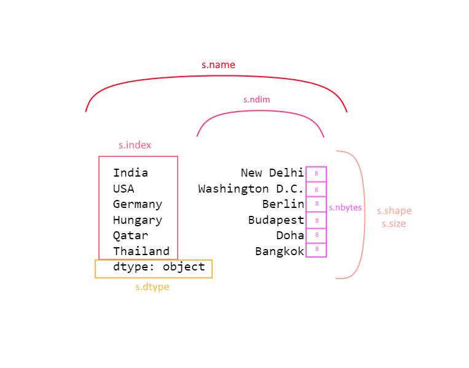

# Basics of Series data structure in Pandas

* Series is a data structure in pandas that is similar to ```ndarray``` from NumPy but it is labeled(axis labels)
* It is one dimensional and can hold any data types

## Structure

* labels/index - pandas allows non unique index values, default indexes are ```0,1,2..., len(data)-1```
* the data
* dtype - data type of elements in the Series


## Series creation

* from scalar values - index must be provided
* from list or tuple
* from dicts
* from NumPy arrays

## Some of the attributes

* ```Series.index``` - multi-set, allows duplicate values, used to identify,index and align data in Series
* ```Series.array``` - reference to the data as ```ExtensionArray```
* ```Series.values``` - reuturns ```ndarray``` like objects
* ```Series.dtype``` - the data type of series
* ```Series.shape``` - shape of the series as tuple - ```(n,)```
* ```Series.nbytes``` - the total size of series in ```bytes```
* ```Series.ndim``` - returns the dimensions which is always ```1``` with ```Series```
* ```Series.size``` - returns the number of elements
* ```Series.T``` - returns the transpose
* ```Series.hasnans``` - returns ```True``` if ```NaN``` is present i series
* ```Series.name``` - name of the series if provided



## 


