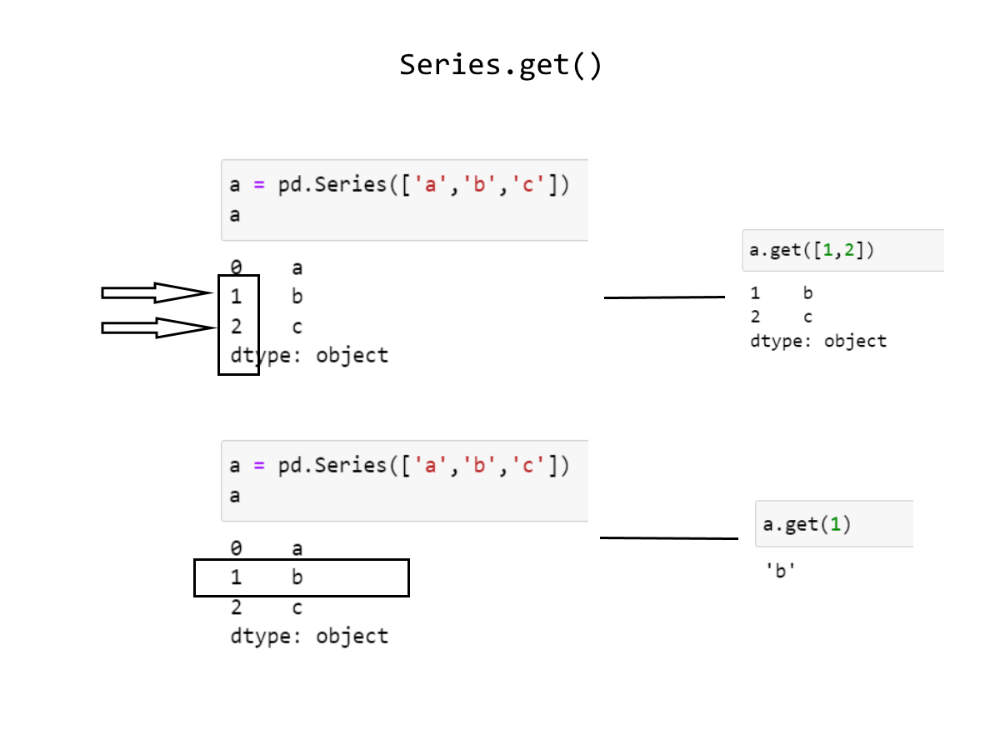

# Indexing and accessing data from Series

## Functions to get data

* ```Series.get(index, default = None)``` 
    * if there is no key found then it returns ```None```
    * multiple keys can be passed as a sequence
    * can return multiple values


 
* ```Series.at[key]```
    * it is a property that supports indexing but not a function 
    * it is mainly used to get scalar/single value
    * returns just a single value based on the key/label value, if invalid key then it throws ```KeyError```
* ```Series.iat[integer]```
    * similar to ```Series.at``` but this takes in the integer position as argument
* ```Series.loc[key]```
    * returns scalar, Series or DataFrame based on the label/key value passed
    * possible arguments
        * single key
        * sequence of keys
        * slice objects - both start and stop are included, for date time string like dates can be provided
        * boolean array - denoting the inclusive keys as ```True``` and the rest as ```False```
* ```Series.iloc[integer]```
    * same as ```Series.loc``` but accepts integer as arguments

